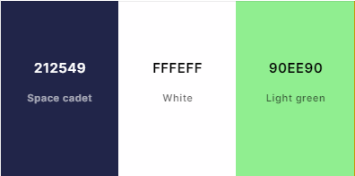
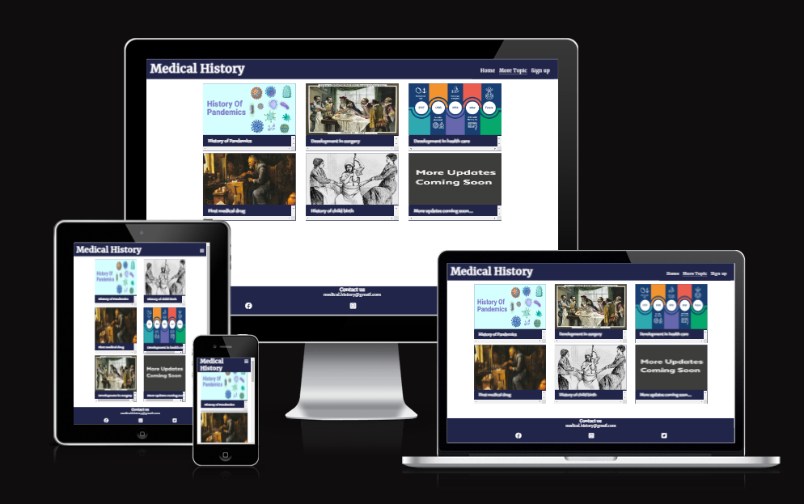

# Medical History

Medical History website is for students aged 10 to 16 who wants to learn about the history of medicine. Its main purpose is to inform students about crucial events that occured in the past which shape the medical world as it is today. Moreover, students will be able to find more topics with their history and images for visual reprensentation and students can also sign up for the form.

Visit the deployed site here :[Medical History](https://dhruvesh48.github.io/Project-1-html-css/)

---

## User Experience - UX

---

### Initial Discussion

#### Key information for the site

- An introduction to Medical History.
- Details about vaccination history.
- Images of early vaccination phases.
- Shows more similar topics like vaccination.
- How to get notify for more updates.
- A way to contact Medical History.

---

### User Stories

---

#### Client Goals

- To be able to view the website on a variety of device sizes.
- To provide an clear overview of the history facts.
- To be able find images related to the topic.
- To allow people to contact Medical History to ask questions, to request further information about the topic and can share more ideas of what topic they want to see.
- To be able to find multiple topics they want to learn about.

#### First Time Visitor Goals

- I want to find out about what Medical History provide and want image to back it up.
- I want to navigate the website easily and view the information.
- I want to see images of what information is written about.
- I want to be able to contact Medical History.
- I want to find their Social media links.

#### Returning Visitor Goals

- I want to be able to get notify when new topics are updated to the website.
  
#### Frequent Visitor Goals

- I want to see and learn about more topics.
- I want to be able to suggest what new topic Medical History can add to the website.

---

## Design

---

### Colour scheme

Medical History colour palette

- The website uses backgound color #212549 and for the text #fffeff this are use in header(navbar), in the main body for headings, in the footer and in the sign up form.
- In the sign up form with laptop screen or larger, the mouse hover used box shadow of #90ee90 to the form input fields to suggest what user is about to click.
- For normal text the default color of the browser is used.
- The colour scheme is consistent throughtout the whole website.

### Typography

---
Google Fonts was used to import the fonts used for this site.

- The Merriweather font is used for the whole body section of the website with serif as a backup font.
- The other parts of the project used the default browser fonts.

### Imagery  

---
All of the images used on this site is from the the external websites which will be credited in the credit section.

## Features

---

### General Features on each page

---
All the pages on the website have :

- A favicon which is the centre part of the Medical History.
- A navbar which allows the users to easily navigate through the site. On mobile devices and on tablet device the navbar is collapsed into a burger icon with a dropdown navbar.
- A footer which contains links to the social media accounts.

#### Home(index) Page

---
The Home Page is divided into seven sections:

- The Hero image
- What is vaccination?
- Variolation
- First Vaccination
- First rabies vaccine
- Development of Vaccines
- Elimination Efforts

The Home page provides information about the history of vaccination how it was back in 1400's to now in 2oth century with images.

#### More Topic page

---

- The more topic page provides information about upcoming topics that would be updated later.
- It features images with the heading showing what it will be.

#### Sign up page

---
The Sign up page contains form in which user will be requested to put their details before submitting the form.

The Sign up form has the following features:

- Clearly labelled text inputs with placeholder text.
- On larger screens, the text input has a box shadow means it will have shadow of green color when hovered over.
- There are three separate requests with each need to be filled.
- To increase accessibility, the checkboxes have been made large, and change colour when hovered over.
- There is a submit button which has green shadow when hovered over. When clicked, the submit button leads the user to code institute action page.

#### Future Features

---

- Seprate HTML page will be created for the home page insted of vacination history.
- The vaccination page will be in more topic section and each section will be clickable link that will lead user to that page.
- Their will be links of other website for the user who wants to know more details about the specific topic.
- New action form will be created letting user know they are signed in.

---

## Medical History - TESTING DOCUMENTATION

---

## AUTOMATED TESTING
  
### W3C Validator

[W3C](https://validator.w3.org/) was used to validate all HTML pages, as well as the [CSS](https://jigsaw.w3.org/css-validator/#validate_by_uri).
  
- [Home page W3C HTML Validation](docs/home-page-HTML-validator.png) - Pass
- [More-topic page W3C HTML Validation](docs/more-topic-HTML-validator.png) - Pass
- [sign up page W3C HTML Validation](docs/signup-HTML-validator.png) - Pass
- [style.css CSS Validation](docs/CSS-validator.png) - Pass

---

### Lighthouse

Lighthouse from the Chrome Developer tools was used to test the performance, accessibility, best practices and SEO of each page on the website.

### Desktop Results

- Home page

  
- More-topic page

  
- Sign up page

  

### Mobile Results

- Home page

  
- More-topic page

  
- Sign up page

  

## Manual Testing

### Responsiveness

---

Each page has been inspected on variety of devices such as mobile, laptop, desktop. Moreover, they have been tested on multiple browser such as Google, Microsoft edge.

- Home page Mobile device
  

- More topic page Mobile device

- Sign up page Mobile device

- Home page Desktop device
  

- More topic page Desktop device

- Sign up page Desktop device

### Validation

- The Sign up Form:
  - This page will allow users to sign up for notifications about new updates or topics that will be released. Users will need to provide their details, including First Name, Last Name, and Email Address. If a user does not provide a First Name or Last Name, they will be prompted to fill in these details. Regarding the email address, if it is not valid, users will be asked to enter a valid email address. Once all the details are correct, users will see the Code Institute sign-up form.

- The header section:
  - Medical History name has a clickable link to the Home page.
  - Home page has a clickable link to the Home page.
  - More topic has a clickable link to the More topic page.
  - Sign up has a clickable link to the Sign up page.

- The footer section:
  - Facebook Font Awesome has a clickable link to the Facebook page.
  - Instagram Font Awesome has a clickable link to the Instagram page.
  - Twitter(X) Font Awesome has a clickable link to the Twitter(X) page.

## Accessibility

---
Care has been taken throughout the coding to ensure that this website is as accessible friendly as possible. Particular attention has been given to the following points:

- Using semantic HTML.
- Ensuring sufficient contrast between the text and its respective background.
- Using a box shadown color for the buttons and the text input fields.
- Using large checkboxes in the sign up form.
- The use of accurate alt descriptions for the images used in the website.
- Used hover border-bottom line below the navbar, easier for users to navigate.
- The css section is in alphabetically order for easier accessibility.

## Technologies used

#### Language used

HTML and CSS are the languages used on this website.

#### Frameworks, Libraries & Programs Used

- [Favicon.io](https://favicon.io/) - To create and download the favicon logo.
- [Google HTML/CSS style guide](https://google.github.io/styleguide/htmlcssguide.html) - To create proper pages with rules.
- [ui.dev](https://ui.dev/amiresponsive) - To create views of the website on different viewing devices.
- [Google Fonts](https://fonts.google.com/) - for importing the font families used.
- [Font awesome](https://fontawesome.com/) - for the social media and navbar burger icons.
- [W3C HTML validator](https://validator.w3.org/) - To validate all the HTML file.
- [W3C CSS validator](https://jigsaw.w3.org/css-validator/) - To validate CSS file.
- [Google Dev tools](https://developer.chrome.com/docs/) - to troubleshoot and test issues during the development.
- [MDN webdocs](https://developer.mozilla.org/en-US/) - reference
- [W3C schools](https://www.w3schools.com/) - for resolving code format in CSS and HTML.
- [Huemint](https://huemint.com/brand-intersection/) - for choosing the color palettes.
- [Compress-or-Die](https://compress-or-die.com/webp) - for compressing the image and changing its format to webp.
- [Flaticon](https://www.flaticon.com/free-icons/injection) - for favicon icon image.

## Deployment

---
 This site was deployed using the following steps:

1. Open GitHub.
2. Select the project to be deployed.
3. Go to 'Settings'.
4. In the Code and Automation section, select Pages.
5. Set Source to 'Deploy from a branch'.
6. Select Main Branch.
7. Set Folder to 'Root'.
8. Under Branch click 'Save'
9. The link to the live website is now displayed at the top of the page.

### Local development

---

#### How to Fork

1. Log in to Github.
2. Go to the repository for this project.
3. At the top right of the page, click the "Fork" button. This will create a copy of the repository under your Github account.

#### How to clone

1. Log in to Github.
2. Go to the repository for this project.
3. Click on the "Code" button, select from HTTPS, SSH or Github CLI.
4. Copy the URL for the repository.
5. Open your terminal or command prompt.
6. Navigate to the directory where you want to clone your repository.
7. Use the `git clone` command followed by the URL that you have copied.

## Credits

### Content

- The text in index.html in the section First rabies vaccine the first opening section about Louis Pasteur and the boy is taken from [CDC](https://www.cdc.gov/mmwr/preview/mmwrhtml/00000572.htm#:~:text=On%20July%206%2C%201885%2C%20Louis,rabid%20dog%202%20days%20before)

### Media

- Home page
  - Starting image and First vaccination section image is from [wikipedia](https://en.wikipedia.org/wiki/Edward_Jenner)
  - Vaccination section image is from [Queen Camel Medical Centre](https://www.queencamelmedicalcentre.co.uk/flu-and-covid-vaccinations/)
  - Variolation section image is from [Journal of Trauma and Injury](https://www.jtraumainj.org/journal/view.php?number=1218)
  - First rabies vaccine section image is from [PBS](https://www.pbs.org/newshour/health/louis-pasteurs-risky-move-to-save-a-boy-from-almost-certain-death)
  - Development of Vaccines section image is from [Understanding Animal Research](https://www.understandinganimalresearch.org.uk/resources/infographics/history-of-vaccines-timeline)
  - Elimination Efforts section image is from [Freepik](https://www.freepik.com/vectors/virus-eradication/5)

- More topic page
  - History of Pandemics section image is from [My Bio source](https://www.mybiosource.com/learn/history-of-pandemics/)
  - First medical drug section image is from [ATSE](https://www.atse.org.au/news-and-events/article/what-was-the-first-medicine-to-be-invented-in-a-laboratory/)
  - Development in surgery section image is from [LP FERGUSSON](https://lpfergusson.com/2016/05/13/barber-surgeons/)
  - History of child birth section image is from [The Guardian](https://www.theguardian.com/books/2021/jan/26/i-enjoyed-researching-the-bloody-history-of-childbirth-then-i-had-a-baby-outlawed-anna-north)
  - Development in health care section image is from [NIHR](https://bepartofresearch.nihr.ac.uk/articles/history-healthcare-research/)
  - More updates coming soon section image is from [The Fortis Lite](https://panel.com.sg/portfolio/more-coming-soon/)

- Sign up page
  - Background image is from [The Royal Society of Medicine](https://www.rsm.ac.uk/sections/history-of-medicine-society/)
